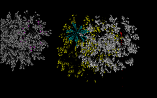
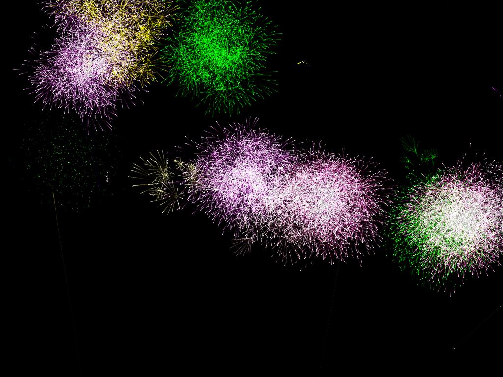

# Fireworks 2D

Best to run a **Release** build in a full-screen mode 

- with 3 buffers like: `dotnet Fireworks2D.dll -f -l 2 -w 3840 -h 2160`
- with a V-sync enabled: `dotnet Fireworks2D.dll -v -f -l 2 -w 3840 -h 2160`
- higher resolution (will be down-sampled to display resolution using OpenGL): 
  `dotnet Fireworks2D.dll -f -v -w 5760 -h 3240 -l 2`

Originally a DOS project written in a year 2000 using [Pascal (programming language)](https://en.wikipedia.org/wiki/Pascal_(programming_language)) and compiled using [Turbo Pascal](https://en.wikipedia.org/wiki/Turbo_Pascal).

It used video mode 13h originally (320x200 pixels @ 8bit palette / 256 colors), but it's using modern tricks this time thanks to [Mode-13HX](https://github.com/VasilijP/mode-13hx). I have ported this multiple times in last 20+ years, since it is a small and fun project to play with.

It should work on any platform and architecture where .Net 8 and C# is supported. I added special code path for AVX512 (fading) and SSE (color mixing) to speed things up.

- Old program did look like this: 
  

- Now with more pixels, colors and fps: (downscaled cutout from 4k)

  

